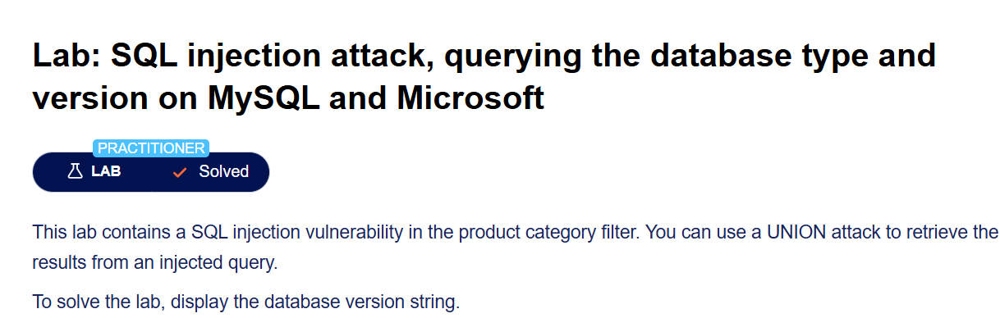
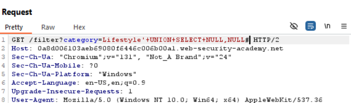
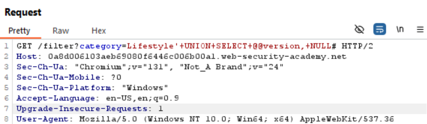

## Lab: SQL injection attack, querying the database type and version on MySQL and Microsoft

## Step 1

Checking number of column

## Step 2

Check which column we can insert in

Here we are able to insert in both column

## Step 3

Now we use this payload

' UNION SELECT @@version,NULL#

Or

' UNION SELECT NULL,@@version#

Encode it to URL

Here we get the answer

---
